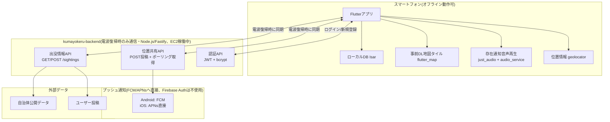
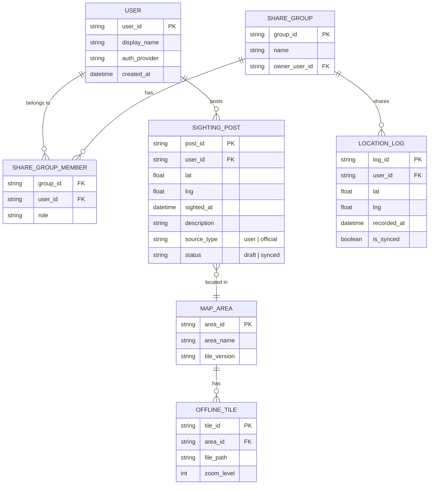
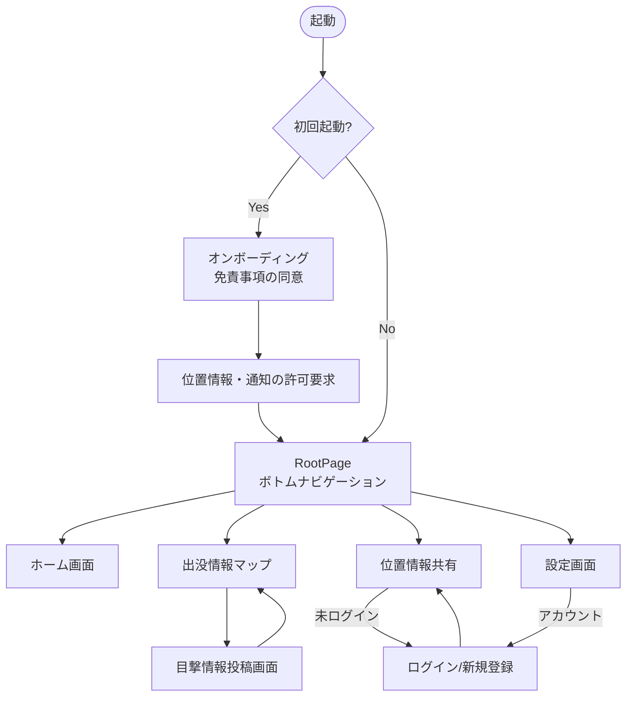

# クマヨケール ― 登山のお守り 全体設計書

> 文書名: クマヨケール ― 登山のお守り 全体設計書
> アプリ名: クマヨケール(キャッチコピー: 登山のお守り)
> バージョン: v1.3(バックエンド方針最終確定・2026-07-29)
> ステータス: 検討中

> 📝 2026-07-29更新: バックエンド構成を最終決定。Firebase → AWS(Cognito/DynamoDB/Lambda)の検討を経て、
> 既存の自前バックエンドリポジトリ [nakayu206/kumayokeru-backend](https://github.com/nakayu206/kumayokeru-backend)
> (Node.js/Fastify、AWS EC2上で稼働中: `https://57-182-248-130.sslip.io`)を使う方針に確定した。
>
> 📝 これまでの経緯: 当初「音でクマを威嚇・撃退する」アプリとして構想したが、調査の結果、クマの聴覚特性を実測した学術データが乏しく、忌避効果も査読付きで実証されていないことが判明。「人の存在を知らせて不意の遭遇を避け、出没情報とオフライン地図で安全をサポートする」アプリへとコンセプトを再定義した。

---

## 1. プロジェクト目標

### ミッション
登山・ハイキングをする人が、クマとの不意の遭遇による事故を減らし、安心して山に入れる状態をつくる。

### ゴール(定量・定性)
- 完全オフライン環境(電波なし山中)でも、存在通知機能とオフライン地図が問題なく動作する
- クマ出没情報を、入山前に確認できる状態を作る
- 緊急時に家族・仲間へ位置情報を共有できる
- 「クマを倒す・撃退する」という誇大な効能表示をせず、誠実な情報提供を行う

### スコープ外(v1.0では対応しない)
- クマ以外の野生動物(イノシシ・シカ等)への個別最適化
- 海外の山域への対応(初期は日本国内の登山道に限定)
- ハードウェア連携(専用スピーカー・IoTデバイスとの連携)

---

## 2. テーマ・コンセプト

**「音で撃退する」のではなく、「気配を伝えて、すれ違う」。**

- クマは本来、人を避ける習性がある動物。事故の多くは「不意の遭遇(バッタリ遭遇)」で起きる
- アプリの役割は「クマを追い払う」ことではなく、「クマより先に、人がそこにいることを伝える」こと
- あわせて、出没情報・オフライン地図・仲間との位置共有によって「遭遇そのものを避ける行動」を支援する
- トーン&マナー: 過度に不安を煽らず、誠実で落ち着いた「登山の相棒」のような存在を目指す

---

## 3. 対象ユーザー・ペルソナ

| ペルソナ | 属性 | ニーズ |
|---|---|---|
| 単独行の登山者(30代・週末登山者) | 平日は会社員、週末に日帰り登山 | 一人で入るので不安。何かあった時に家族に知らせたい |
| グループ登山リーダー(40代) | 友人と月1回程度登山 | メンバーの位置を把握したい。出没情報を事前確認したい |
| 地元の里山利用者(60代) | 山菜採り・散歩で日常的に里山へ | 出没直後の最新情報がすぐ欲しい |

### 想定利用環境
- 電波: 登山口〜稜線は圏外が多い(完全オフライン前提)
- デバイス: 個人所有のiPhone / Androidスマートフォン(専用ハードウェアは持たない)

---

## 4. 主要機能

### 存在通知機能(コア機能)
一定間隔で鈴音・人の声などを自動再生し、周囲に人の存在を知らせる。環境省・自治体が一貫して推奨する「音や声で人の存在を知らせ、不意の遭遇を避ける」手法をアプリで自動化する。「クマを撃退する」という断定的な訴求はしない。

**バックグラウンド音声再生の技術詳細**

| OS | 使う仕組み | 注意点 |
|---|---|---|
| iOS | `AVAudioSession`を`.playback`カテゴリに設定 + Background Modesで「Audio」を有効化 | 実際に音を鳴らし続けている状態でないと継続を許可されない。無音ループでの延命は規約上グレー |
| Android | フォアグラウンドサービス、Android 14以降はサービス種別`mediaPlayback`の明示宣言が必須 | 端末独自の省電力機能で強制終了されがちなため、バッテリー最適化除外の案内画面が実質必須 |

開発上の落としどころ: Phase 0で複数機種(Xiaomi・OPPO・Pixel・iPhone等)で「1時間放置して本当に鳴り続けるか」を実機検証する。停止時は通知で知らせ、省電力モード時は再生間隔を延長する。

### クマ出没情報マップ
自治体・ユーザー投稿による目撃情報を地図上に表示・投稿できる。既存の類似アプリ(クマ出没マップ・クマップ等)のニーズの高さがそれを裏付けている。

### オフライン地図
事前ダウンロードした地図をもとに、電波なしでも現在地を表示する。登山道の多くは圏外であり、地図が使えなければ他の機能も意味をなさないため、アプリの前提条件となる基盤機能。

### 位置情報共有(安心機能)
電波が入るタイミングで家族・仲間に現在地を共有する。単独登山者にとって「何かあった時に気づいてもらえる」ことは心理的安心感に直結する。**Phase2でアカウント(kumayokeru-backendのJWT認証)が必要。**

### 出没情報の投稿・共有
利用者自身が目撃情報を投稿し、他の利用者と共有する。自治体データだけでは即時性・カバー範囲に限界があるため、市民科学的なデータ収集(海外のGrizzTracker等の先行事例あり)で補完する。

---

## 5. 非機能要件

| 分類 | 要件 |
|---|---|
| オフライン動作 | 存在通知機能・オフライン地図表示は通信環境なしで完全動作すること |
| 省電力 | 長時間登山(数時間〜1日)でもバッテリーが持続する設計(間欠再生、省電力モード) |
| 耐久性・安全性 | 誤操作しにくいUI、緊急時にすぐ使える導線(グローブをした手でも操作しやすいボタンサイズ等) |
| パフォーマンス | オフライン地図の表示・スクロールがラグなく動作すること |
| 対応OS | iOS 16以降 / Android 10(API 29)以降を目安に、主要旧バージョンもカバー |
| アクセシビリティ | 文字サイズ変更・高コントラスト表示に対応 |
| 法規制配慮 | 自然公園法の利用調整地区・特別地域における音量規制への注意喚起表示 |
| 免責表示 | 「クマ遭遇を完全に防ぐものではない」旨の注意喚起をオンボーディング・設定画面に明記 |

**法規制の詳細**

| 法令・条例 | 内容 | アプリへの影響 |
|---|---|---|
| 自然公園法 | 「利用調整地区」「特別地域」では非常時を除き拡声器等で「必要以上に大きな音」を発する行為を禁止 | 入山エリアが自然公園内かどうかで、注意表示・音量制限の挙動を変える必要がある可能性 |
| 自治体の拡声機条例 | 主に街頭宣伝・選挙カー等の商業目的の大音量が対象 | スマホ単体の音量は通常規制値に届きにくいが、都市部の登山口付近では念のため配慮 |
| 騒音規制法 | 個人のスマホ使用を直接縛るものではない | 直接的な法的リスクは低いが、迷惑防止条例等で別途問題化する可能性はゼロではない |
| 高周波音の人体影響 | モスキート音(17〜20kHz程度)は若年層に不快感・頭痛を与えるとの報告あり | 法律ではなく配慮事項として、音量上限・年齢的な注意喚起を設ける |

実務での落としどころ: ①位置連動で「現在地は自然公園の特別地域内です。音量にご配慮ください」等の注意表示を出す、②初期音量は控えめに設定し最大音量は手動選択とする、③オンボーディングで「法令を遵守してご利用ください」への同意を得る、④リリース前に自然公園法・環境法に詳しい弁護士へのレビューを依頼する。

---

## 6. セキュリティ・プライバシー

- 位置情報は本人の同意(オプトイン)なしに共有・送信しない
- 家族・仲間との位置共有は、共有相手を明示的に指定した場合のみ有効化
- ユーザー投稿(目撃情報)は個人が特定できる情報(氏名・顔写真等)を含めない設計・投稿ガイドラインを用意
- 通信時はHTTPS(TLS)を必須化
- 位置情報・投稿データの保存期間、削除依頼への対応方針を定める(プライバシーポリシーに明記)
- 未成年利用時の保護者同意フローを検討(想定ユーザーは主に成人だが要検討)

---

## 7. 技術スタック

> オフライン動作・バックグラウンド音声再生・地図描画の3点が要件上のボトルネックになるため、これらのネイティブ機能に強いスタックを軸に選定。過去プロジェクト(TekuShare)の構成を踏襲し、MVP段階はサーバーコストゼロで運用できる構成にしている。

| 領域 | 技術 | 選定理由 |
|---|---|---|
| メインフレーム | Flutter / Dart | 単一コードベースでiOS/Android同時開発 |
| 位置情報 | geolocator | GPS単体(通信不要)で現在地取得 |
| 地図 | flutter_map + OpenStreetMap(無料) | ライセンス・コスト面で有利。オフライン表示は`flutter_map_tile_caching`で事前タイルキャッシュ |
| 距離計算 | latlong2 | 出没情報ピンと現在地の距離判定に使用 |
| ローカルDB | Isar | 出没情報・地図タイルキャッシュ・設定値のオフライン保存 |
| 状態管理 | Riverpod(コード生成なし・手動Provider定義) | テスト容易性・DIのしやすさを優先。TekuShareと同方針 |
| バックグラウンド音声 | just_audio + audio_service | 存在通知音の継続再生に対応 |
| 通知 | flutter_local_notifications | 再生停止時のセルフチェック通知、出没情報の更新通知 |
| 写真投稿 | image_picker | 目撃情報投稿時の写真添付(Phase2) |
| HTTP通信 | http または dio | kumayokeru-backendとの通信(Phase2) |
| 認証(Phase2) | **自前バックエンド(JWT + bcrypt)** + flutter_secure_storage | [kumayokeru-backend#5](https://github.com/nakayu206/kumayokeru-backend/issues/5)。Cognito等の管理サービスは使わない |
| 位置共有・出没情報データ(Phase2) | **自前バックエンド(kumayokeru-backend)** | SQLite→将来PostgreSQL。位置共有はPOST投稿+ポーリング取得([kumayokeru-backend#6](https://github.com/nakayu206/kumayokeru-backend/issues/6)) |
| プッシュ通知(Phase2) | Android: **FCMのみ利用**(Firebaseは通知送信の窓口としてだけ使う) / iOS: **APNsに直接接続**(Firebase不要) | [kumayokeru-backend#7](https://github.com/nakayu206/kumayokeru-backend/issues/7) |
| 出没情報API | 自前バックエンド **kumayokeru-backend**(Node.js/Fastify、AWS EC2上で稼働中) | `https://57-182-248-130.sslip.io`(Swagger: `/documentation`)。公開データの正規化・キャッシュ層 |
| CI/CD | GitHub Actions + Fastlane | ビルド・ストア申請の自動化 |
| クラッシュ・分析 | Sentry | 障害の早期検知、利用状況分析 |

**コスト設計**

| 段階 | 構成 | コスト |
|---|---|---|
| MVP(Phase 1) | 地図=OpenStreetMap(無料)、DB=Isar(ローカル保存) | サーバー代ゼロ |
| リリース時(Phase 2以降) | kumayokeru-backend(EC2 t3.micro無料利用枠、12ヶ月) | 無料枠終了後は低コストだが要注意。詳細は[kumayokeru-backend/docs/AWSデプロイ手順.md](https://github.com/nakayu206/kumayokeru-backend/blob/main/docs/AWSデプロイ手順.md) |

> Firebaseは「FCMによるプッシュ通知配信」以外の用途(Auth/Firestore等)では使わない方針。
> 📝 2026-08-18更新: Firebaseプロジェクトを作成済み。緊急連絡(SOS)送信時に、自分以外の
> グループメンバーへプッシュ通知する用途で利用開始(kumayokeru-backend#7)。詳細は
> [android_release_checklist.md](android_release_checklist.md)の「google-services.json」項目を参照。

---

## 8. アーキテクチャ(クリーンアーキテクチャ)

```
Infrastructure → Repository → State → Derived → UI
(OS/HW)          (DB/API)     (状態)  (派生)     (画面)
```

| 層 | 役割 |
|---|---|
| domain | ビジネスロジックの核。FlutterもIsarも知らない。何にも依存しない |
| data | domainのインターフェースを実装。Isar/kumayokeru-backend APIを知る。依存はdomainのみ |
| presentation | UIとRiverpodプロバイダー。domain・dataに依存 |
| infrastructure | GPS・音声再生・通知・カメラなどOS依存処理。独立 |
| core | 全層から使う定数・ユーティリティ。依存なし |

**存在通知機能の状態遷移**

```
idle → [通知ON] → notifying
  notifying → [30秒経過]     → 音声再生(stateはnotifyingのまま)
  notifying → [再生失敗検知]  → 再生停止アラート通知(stateはnotifyingのまま)
  notifying → [通知OFF]      → idle
```

**システム構成図**



---

## 9. データ設計(ER図)



`USER.auth_provider`はPhase2でkumayokeru-backendが発行するユーザーID(JWTの`sub`)を想定。

---

## 10. 開発ロードマップ

| フェーズ | 期間目安 | 内容 | GitHub Issue |
|---|---|---|---|
| Phase 0: 検証 | 2週間 | 実機での高周波再生・バックグラウンド音声・オフライン地図の技術検証、法務レビュー | #1 |
| Phase 1: MVP開発 | 6〜8週間 | 存在通知機能(基本)+オフライン地図+出没情報マップ(閲覧のみ) | #2 |
| Phase 2: β版 | 4週間 | 出没情報の投稿機能、位置情報共有(仲間・家族)、kumayokeru-backend(JWT認証等)との結合 | #3 |
| Phase 3: 正式リリース | 2週間 | ストア申請・審査対応、プライバシーポリシー・免責事項の最終確認 | #4 |
| Phase 4: 運用・改善 | 継続 | 利用データ分析、出没情報データソースの拡充、機能改善 | #5 |

画面別のUI/Logic issueは #6〜#15 を参照。

---

## 11. ファイル構造

```
kumayokeru-app/
├── lib/
│   ├── main.dart
│   ├── main_dev.dart / main_stg.dart / main_prod.dart   # Flavor別エントリポイント
│   ├── app.dart
│   ├── core/
│   │   ├── config/                # flavor.dart
│   │   ├── constants/             # app_colors, app_spacing, app_sizes, map_constants
│   │   ├── errors/
│   │   ├── utils/
│   │   └── extensions/
│   ├── domain/
│   │   ├── entities/
│   │   ├── repositories/
│   │   └── usecases/
│   ├── data/
│   │   ├── models/
│   │   ├── datasources/           # local(Isar) / remote(AWS)
│   │   └── repositories/
│   ├── presentation/
│   │   ├── providers/
│   │   └── pages/                 # root / home / sighting_map / location_sharing / settings / auth
│   └── infrastructure/
├── assets/
│   ├── audio/
│   ├── map_tiles/
│   └── images/
├── test/
├── integration_test/
├── docs/                          # 本ドキュメント群
├── android/ / ios/
└── README.md
```

---

## 12. 画面設計・画面遷移

実装済み画面(静的UI): ホーム / 出没情報マップ / 位置情報共有 / 設定 / ログイン・新規登録。
詳細なワイヤーフレームは各画面のPR(#16等)・issue(#6〜#9, #14)を参照。ボトムナビゲーションでホーム/地図/仲間/設定の4画面を切り替える構成。



---

## 13. エラー・エッジケース定義

| ケース | 想定状況 | 対応方針 |
|---|---|---|
| 完全圏外での起動 | 電波・GPS衛星も掴めない山中トンネル部等 | 「GPS取得中...」表示。前回取得済みの位置情報をキャッシュから表示し、参考値である旨を明示 |
| 地図データ未ダウンロード | 入山前にエリアDLを忘れていた | 起動時に検知し、ダウンロード確認を表示 |
| バックグラウンド再生の強制停止 | Android端末の電池最適化機能によりサービスが停止される | 端末別に電池最適化除外を促すガイド画面を用意。停止時は通知で知らせる |
| 音量ゼロ・マナーモード | OS側の設定で音が出ない状態 | 起動時に音量チェックを行い警告表示。振動での代替通知を検討 |
| 位置情報の許可拒否 | ユーザーが位置情報の許可を拒否 | 出没マップの現在地表示・位置共有機能が使えない旨を説明 |
| 出没情報の誤投稿・悪意ある投稿 | いたずら投稿、誤情報の拡散 | 投稿の通報機能、自治体公式データとユーザー投稿を視覚的に区別表示 |
| バッテリー残量低下 | 長時間利用でバッテリーが尽きそうになる | 残量20%を下回ったら省電力モードを提案する通知 |
| 複数デバイスでの同時ログイン | 同じ家族が複数端末でログイン | 位置共有は最新の更新のみ反映し、Last-write-winsで解決 |

---

## 14. KPI・成功指標

| 指標 | 目標(初期) |
|---|---|
| MAU(月間アクティブユーザー) | リリース3ヶ月で1,000人 |
| 出没情報の投稿数 | 月間50件以上 |
| オフライン地図の事前DL率 | 利用者の70%以上が入山前にDLを完了 |
| クラッシュフリー率 | 99%以上 |
| ストアレビュー評価 | 4.0以上を維持 |

---

## 15. リスクと対応

| リスク | 影響 | 対応 |
|---|---|---|
| 忌避音の効果に対する誇大な期待・クレーム | ユーザーが「効果がなかった」とクレーム、法的リスク | 効能表示を厳格に管理し、免責事項をオンボーディングで明示的に同意させる |
| 自治体データの利用許諾が得られない | 出没情報マップの精度・信頼性が下がる | ユーザー投稿ベースでの運用も並行し、データソースを複線化 |
| バックグラウンド再生がOSアップデートで制限される | コア機能が動作しなくなる | iOS/Androidの主要アップデートを定点観測し、早期対応する保守体制を確保 |
| 実際の事故が発生した場合の責任問題 | ブランド毀損・法的責任 | 免責事項の明記、賠償責任保険の加入検討、専門家(弁護士)によるレビュー |

---

## 16. 用語集

| 用語 | 説明 |
|---|---|
| 存在通知機能 | 鈴音・声などを自動再生し、人の存在をクマに知らせる本アプリのコア機能 |
| 出没情報マップ | クマの目撃・出没情報を地図上に表示する機能 |
| オフライン地図 | 通信環境がなくても表示できる、事前ダウンロード済みの地図データ |
| 馴化(じゅんか) | 同じ刺激(音)に動物が慣れて反応しなくなること |
| ベアスプレー | クマ撃退用の唐辛子成分スプレー。北米で最も効果が実証されている対策 |
| フォアグラウンドサービス(Android) | ユーザーに常時通知を出しながらバックグラウンドで動作し続けるAndroidの仕組み |

---

## 関連ドキュメント

- [デザイントークン.md](デザイントークン.md)
- [コード規約.md](コード規約.md)
- [環境とブランチ運用.md](環境とブランチ運用.md)
- [環境構築手順.md](環境構築手順.md)
- [テスト方針.md](テスト方針.md)
- [android_release_checklist.md](android_release_checklist.md)
- [../ios/FLAVOR_SETUP.md](../ios/FLAVOR_SETUP.md)
